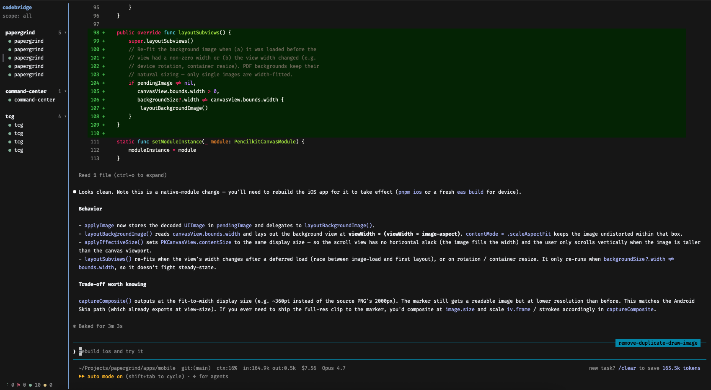

# codebridge

A terminal UI for managing many [Claude Code](https://claude.com/claude-code) (and
[Codex](https://developers.openai.com/codex)) sessions from one place. Instead of one
terminal tab per session — with no central view of which session needs your attention —
`codebridge` gives you a single split view: a session list on the left and the
selected session's **live, interactive** screen on the right, with status that updates as
each session works, waits for approval, or finishes its turn.

It is a single self-contained Rust binary (`cb`). It owns each session's pseudo-terminal
directly — **no tmux dependency** — and a long-lived daemon keeps your sessions alive even
when the UI is closed.



## Why codebridge

The reason I built this: I wanted to run **many agents at once** without losing track of
which one needs me.

- **One view, every session, live status.** Each session in the sidebar shows whether it's
  *working*, *waiting on you*, *needs approval*, or *ended* — sourced from Claude Code and
  Codex hooks, not from scraping the terminal. Approval prompts surface as toasts the
  moment the agent fires the hook, so a `claude` in another repo asking for permission
  doesn't sit silently while you're typing into a different one. `Ctrl-a g` jumps straight
  to the most-recently-pending session.
- **No more juggling tabs/windows.** Running five `claude` sessions used to mean five
  terminal tabs, each one out of sight until you `Cmd-tab` to it. Codebridge collapses
  that into one tab: a sidebar of sessions on the left, the selected session's live
  interactive screen on the right. You spawn, switch, and kill sessions from inside cb;
  the host terminal stays at one window.
- **Sessions outlive your terminal.** A long-lived daemon owns each PTY, so closing the
  terminal window, killing the cb client, or quitting your terminal emulator does **not**
  kill your `claude` / `codex` processes — the daemon, not your shell, is the session's
  parent. They keep working in the background; opening cb in any new tab or window
  re-attaches to exactly the same live screens. Spawn a session in one tab, close that
  tab, and pick it up from another tab later — the work just keeps running.

## How it works

```
            ┌──────────────── cb daemon (long-lived) ────────────────┐
 claude #A ◄┤ each claude runs under a PTY; output is drained into a    │
 claude #B ◄┤ virtual-terminal emulator (the authoritative screen).     │
 claude #C ◄┤ CB_SESSION is injected into each child so Claude Code  │
            │ hooks can report status back.                              │
 hooks ─────┤ unix socket: session list + status, screen streaming,     │
            │ input, control commands. Survives client disconnects.      │
            └───────────────────────────▲───────────────────────────────┘
                                         │ attach / detach
                          ┌──────────────┴───────────────┐
                          │  cb TUI (Ratatui)             │
                          │  sidebar + live screen pane   │
                          └───────────────────────────────┘
```

The dashboard is a two-zone view: a session list (left) and the selected session's live
screen (right). `Ctrl-a` then `→` focuses the screen pane so your keystrokes go straight
to that session; `Ctrl-a` then `←` returns to the list.

Status comes from the **hook** system, not from scraping the terminal: the daemon maps
`SessionStart` → *ready*, `UserPromptSubmit`/`PreToolUse`/`PostToolUse` → *working*,
`Notification`/`PermissionRequest` → *needs approval*, `Stop` → *waiting for you*,
`SessionEnd` → *ended*. Codex uses the same hook shape, so the mapping is shared.

## Terminal support

codebridge is only fully supported on terminals that forward the Kitty keyboard
protocol — currently **Ghostty, WezTerm, Kitty, and iTerm2 (with the Kitty
keyboard extension enabled)**. Other terminals (Terminal.app, stock iTerm2,
Alacritty's default config, GNOME Terminal, etc.) will run codebridge, but a
handful of bindings will be unavailable or fall back to alternatives:

- **Copy with `cmd+c`** — macOS terminals (Terminal.app, default iTerm2, etc.)
  often intercept `cmd+c` at the OS level for their *own* clipboard copy and
  never forward the keystroke to the running program, so cb cannot see it. In
  terminals that do forward Cmd via Kitty keyboard reporting, `cmd+c` re-copies
  the held cb highlight. Everywhere else, cb sidesteps the keyboard:
  - **Just release the mouse.** Drag-selecting in the screen pane auto-copies
    the selection to the system clipboard (via OSC52) the moment you let go —
    no keypress needed. Then `cmd+v` anywhere.
  - **Prefix `y`** explicitly re-copies the held highlight. (`ctrl+c` is *not*
    a copy key — it stays reserved for SIGINT to the focused session.)
  - On iTerm2 specifically, you can rebind `⌘C` under *Preferences → Profiles
    → Keys* to "Send Escape Sequence" so it forwards instead of being
    intercepted, but the auto-copy flow above usually makes this unnecessary.
- **Shift+Enter / Shift+Tab** in the focused session — without Kitty keyboard
  reporting, the terminal can't disambiguate the modifier and the session sees
  a plain Enter or Tab. Use the prefix `enter` binding to insert a newline on
  those terminals.
- **Cmd+Arrow / Option+Arrow** for word/line nav — supported terminals send the
  modified arrow; others map it to a different sequence (codebridge falls back
  to the readline-conventional bytes where it can).

If a key isn't doing what you expect, your terminal probably isn't passing it
through.

## Install

```sh
curl -fsSL https://raw.githubusercontent.com/zihaolam/codebridge/main/install.sh | bash
```

That downloads the latest prebuilt `cb` binary from
[GitHub Releases](https://github.com/zihaolam/codebridge/releases) (no Rust
toolchain required), installs it to `~/.cb/bin`, adds that dir to your `PATH`,
and registers hooks for whichever of claude / codex you have. It's sudo-free
(bun/rustup pattern: its own `~/.cb/bin` dir plus a `CB_INSTALL`/`PATH` line in
your shell rc).

Knobs:

```sh
# pin to a specific release
curl -fsSL https://raw.githubusercontent.com/zihaolam/codebridge/main/install.sh | VERSION=v0.1.0 bash

# install somewhere other than ~/.cb/bin
curl -fsSL https://raw.githubusercontent.com/zihaolam/codebridge/main/install.sh | BINDIR=~/bin bash

# skip hook registration
curl -fsSL https://raw.githubusercontent.com/zihaolam/codebridge/main/install.sh | bash -s -- --no-hooks
```

Build from source instead (needs stable Rust, Zig 0.15.2, and Node.js):

```sh
git clone https://github.com/zihaolam/codebridge && cd codebridge
BUILD_FROM_SOURCE=1 ./install.sh
# or fully by hand:
cd web && npm ci && npm run build && cd ..
cargo build --release
cp target/release/cb ./cb
./cb install-hooks    # wires cb into ~/.claude/settings.json (writes a .bak)
./cb install-codex    # wires cb into ~/.codex/hooks.json (leaves config.toml alone)
```

Hooks are required for live status — without them sessions stay at "starting". The merge
into your existing settings is idempotent and re-running heals stale entries (e.g. after
moving the binary).

## Usage

```sh
cb                 # the split view (auto-starts the daemon)
cb install-hooks   # install the Claude Code hooks
cb install-codex   # install the Codex hooks
cb stop            # kill all sessions and stop the daemon
cb restart         # restart the daemon and its HTTP bridge
cb ctl list|spawn|kill   # scriptable client
cb daemon          # run the hub in the foreground (normally auto-started)
```

### Sidebar keys (list has focus)

Plain keys only navigate the list — every command goes through the prefix so the same
binding works whether the list or the session has focus.

| key | action |
|-----|--------|
| `↑`/`↓` or `k`/`j` | move selection (the right pane follows) |
| `enter` or `→` or `l` | focus the screen pane (type into the session) |
| any `Ctrl-a` command | see the prefix table below |

The list scrolls automatically to keep the selected session in view, so a long
list of sessions is fully reachable.

### Prefix commands

A tmux-style prefix key, **`Ctrl-a`** by default, switches from typing-into-the-session
to issuing a command. Press `Ctrl-a` then tap any of the keys below. The prefix can be
changed in two ways: persistently from the **config menu** (`Ctrl-a o`, see below), or
per-shell via the `CB_PREFIX` env var (e.g. `CB_PREFIX=ctrl+b`) which always overrides
the config file. `Ctrl-a` then `?` (or `h`) toggles a floating cheat-sheet that lists the
current bindings.

| `Ctrl-a` then… | default key | action |
|----------------|-------------|--------|
| focus sidebar  | `←`         | return focus to the list (not rebindable) |
| focus screen   | `l` or `→`  | focus the screen pane |
| toggle hints   | `h` or `?`  | show/hide the floating prefix cheat-sheet (not rebindable) |
| newline        | `enter`     | insert a newline in the session without submitting (works on any terminal) |
| scroll mode    | `[`         | freeze the screen pane to browse scrollback |
| new claude     | `n`         | start a new claude session |
| new codex      | `c`         | start a new codex session |
| kill           | `x`         | kill the current session |
| rename         | `r`         | rename the selected session (defaults to its start folder) |
| jump pending   | `g`         | jump to the session that most recently needs approval |
| scope toggle   | `a`         | toggle this-repo / all sessions |
| yank           | `y`         | copy the held drag-selection to the system clipboard (OSC52) |
| open config    | `o`         | open the config menu (see below) |
| quit           | `q`         | quit cb (sessions keep running) |

### Config menu (`Ctrl-a o`)

Opens a modal that lets you change the prefix, choose a theme and notification delivery,
and rebind every prefix command above.
Changes auto-save to `~/.config/cb/config.json` (or `$XDG_CONFIG_HOME/cb/config.json`)
the moment you press them, so closing the modal commits nothing extra and esc-ing out
of capture mode reverts cleanly.

| key | action |
|-----|--------|
| `↑`/`↓` or `k`/`j` | move the cursor |
| `enter` | edit the highlighted row; theme and notifications open pickers |
| `esc` (while capturing) | cancel the rebind |
| `enter` on **reset all to defaults** | restore the factory bindings |
| `esc` or `q` | close the modal |

The menu refuses to rebind a key that another command already uses, and it refuses the
reserved keys (`esc`, `h`, `?`, arrows, `j`/`k`, `Ctrl-c`) that the system layer claims
before dispatch — both with an inline error so you can pick another key. If `CB_PREFIX`
is set in your shell, the prefix row is shown read-only with a "(locked by CB_PREFIX)"
note, since the env override always wins.

### Themes

Select **theme** in the config menu to open a live-preview picker. Codebridge includes
Terminal (the backward-compatible default), Catppuccin, Catppuccin Latte, Dracula,
Tokyo Night, Nord, Gruvbox, One Dark, Solarized, Kanagawa, Rosé Pine, Vesper, and the
available light variants. Press `enter` to save the previewed theme or `esc` to restore
the prior one.

The theme applies only to Codebridge chrome—the sidebar, borders, status indicators,
pickers, and overlays. Agent terminal cells retain the exact colors produced by Claude
or Codex.

For per-shell selection, `CB_THEME=dracula cb` overrides the saved theme. Semantic
tokens can also be customized in `~/.config/cb/config.json`:

```json
{
  "theme": {
    "name": "catppuccin",
    "custom": {
      "accent": "#f5c2e7",
      "panel_bg": "#181825",
      "green": "#a6e3a1",
      "red": "#f38ba8"
    }
  }
}
```

Supported tokens are `accent`, `panel_bg`, `surface0`, `surface1`, `surface_dim`,
`overlay0`, `overlay1`, `text`, `subtext0`, `mauve`, `green`, `yellow`, `red`,
`blue`, `teal`, and `peach`. Values accept `#rgb`, `#rrggbb`, `rgb(r,g,b)`,
terminal color names, or reset aliases such as `reset`, `default`, and `transparent`.

### Notifications

Select **notifications** in the config menu to choose a Herdr-style delivery mode:

| mode | behavior |
|------|----------|
| `all` | clickable Codebridge toast plus a native OS notification (default) |
| `codebridge` | clickable in-app toast only |
| `terminal` | ask Ghostty, iTerm2, Kitty, or WezTerm to notify via OSC |
| `system` | use the native macOS/Linux notification service |
| `off` | disable agent-state notifications |

Notifications are status-driven: approvals produce **needs attention**, and completed
turns produce **finished**. A one-second default delay suppresses transient states. If
the session is currently visible and the host terminal is focused, its notification is
suppressed; background sessions still notify, and clicking an in-app toast jumps to its
session.

Advanced behavior can be adjusted in `~/.config/cb/config.json`:

```json
{
  "notifications": {
    "delivery": "all",
    "delay_seconds": 1,
    "notify_approval": true,
    "notify_done": true,
    "suppress_focused": true
  }
}
```

`delay_seconds` is capped at one hour. Set `CB_NO_NOTIFY=1` to suppress external
terminal/system delivery for one invocation without disabling Codebridge’s in-app
toasts.

### Scroll mode (browsing scrollback)

`Ctrl-a` `[` freezes the screen pane and lets you scroll up through the session's
history (the border turns magenta). cb captures wheel and drag events so scrollback
selection can autoscroll; hold Shift while dragging if you want your terminal's
native selection instead.

| key | action |
|-----|--------|
| `↑`/`↓` or `k`/`j` | scroll one line |
| `pgup`/`pgdn` (or `b`/`f`/space) | scroll a page |
| `g` | jump to the oldest line |
| `G` | jump back to the live bottom |
| `esc` or `q` | leave scroll mode (back to the live screen) |

## Phone access (`cb web`)

The daemon automatically starts a mobile web app — the same sidebar + live screen, from
your phone: watch sessions, approve permissions, send prompts, spawn new agents per
worktree. The bridge talks to the daemon like any other client; the daemon package itself
doesn't know the web exists.

```sh
cb                     # also starts http://127.0.0.1:8899 (embedded UI, WebSocket at /ws)
cb web                 # prints the default bridge address
```

### Expose it on your tailnet

The bridge binds `127.0.0.1` only — remote access is designed to go through
[Tailscale](https://tailscale.com), which gives you encryption, device identity, and a
real HTTPS cert with zero public exposure:

1. Install Tailscale on the Mac and on your phone; log both into the same tailnet.
2. Publish the bridge, tailnet-only, with HTTPS:

   ```sh
   tailscale serve --bg 8899
   ```

   This fronts `127.0.0.1:8899` at `https://<your-machine>.<tailnet>.ts.net` with a
   valid certificate (needed for the PWA install and clipboard access). `tailscale
   serve status` shows the URL; `tailscale serve --https=443 off` undoes it.
3. Pair the phone. The web app authenticates with a bearer token (the tailnet
   authenticates the *device*; the token authenticates the *client* — it's what stops a
   random webpage on any tailnet machine from reaching your daemon):

   ```sh
   cb web qr --url https://<your-machine>.<tailnet>.ts.net
   ```

   Scan the QR code from the phone — the token rides in the URL fragment and is stored
   locally on first open. `cb web token` prints it; `cb web token rotate` revokes it
   (existing phones must re-pair).

### Install as an app (iOS)

Open the `ts.net` URL in Safari → Share → **Add to Home Screen**. It launches
full-screen with its own icon like a native app. If the phone can't connect later,
check that the Tailscale VPN toggle is on (Settings → enable Tailscale's on-demand /
always-on VPN to make it self-heal).

On the phone, the sidebar and terminal are two screens (back button in the top bar), a
key strip provides the keys the phone keyboard doesn't have (esc, tab, shift+tab,
arrows, ctrl-C, and a jump-back-to-live for scrollback), touch-drag on the terminal
browses scrollback, and the `+` on a workspace opens the same worktree → agent picker
as `Ctrl-a w`.

Keep in mind the phone claims the session's terminal size when it attaches (so the
screen fills) — if the desktop TUI is watching the same session, whoever attached last
wins the size, tmux-style.

## State & files

- `~/.cb/daemon.sock` — daemon control socket
- `~/.cb/daemon.log` — daemon log
- `~/.cb/web.json` — `cb web` bearer token (`cb web token [rotate]`)
- `~/.config/cb/config.json` (or `$XDG_CONFIG_HOME/cb/config.json`) — prefix and key bindings (managed by the in-app config menu)

## Status

Complete: session core, hooks (Claude Code + Codex), the unified sidebar + live screen
view, and lifecycle (auto-start, clean shutdown, dead-session reaping). See `CLAUDE.md`
for architecture details and known gotchas.
